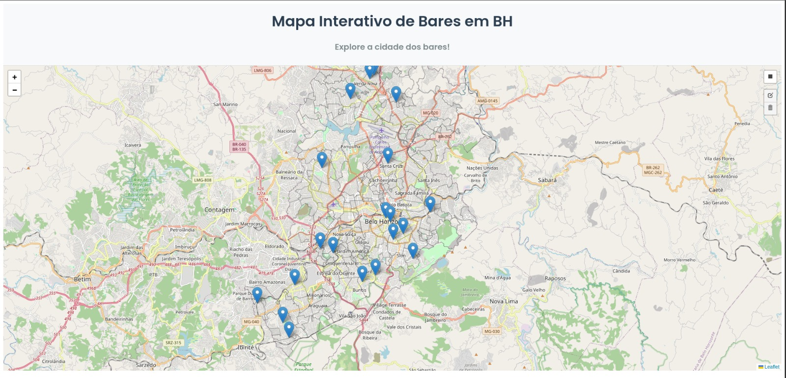
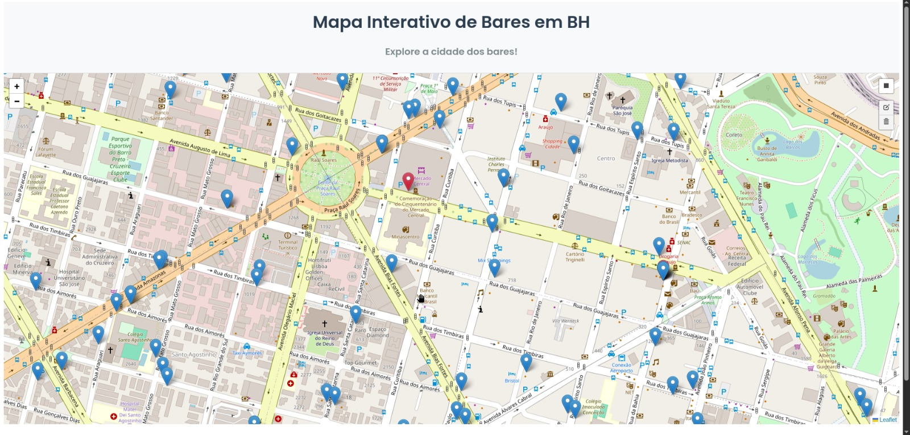
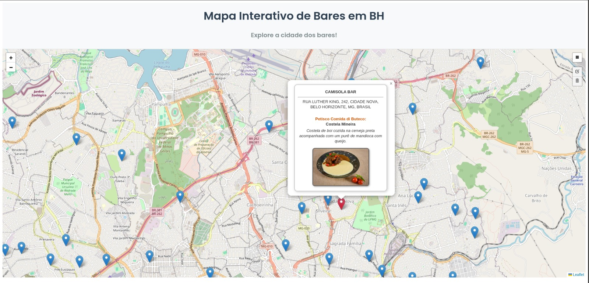
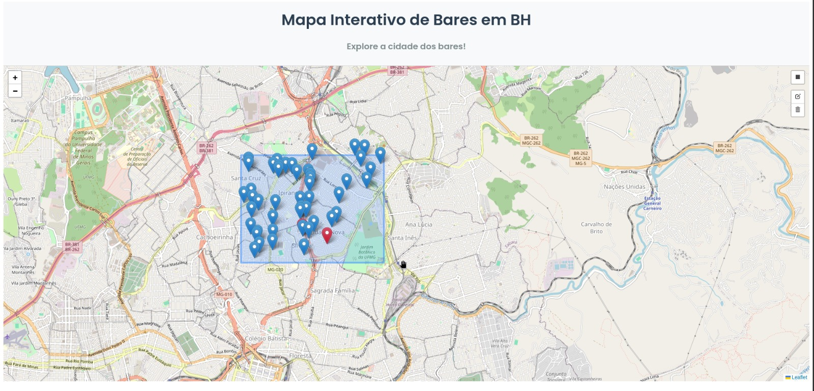
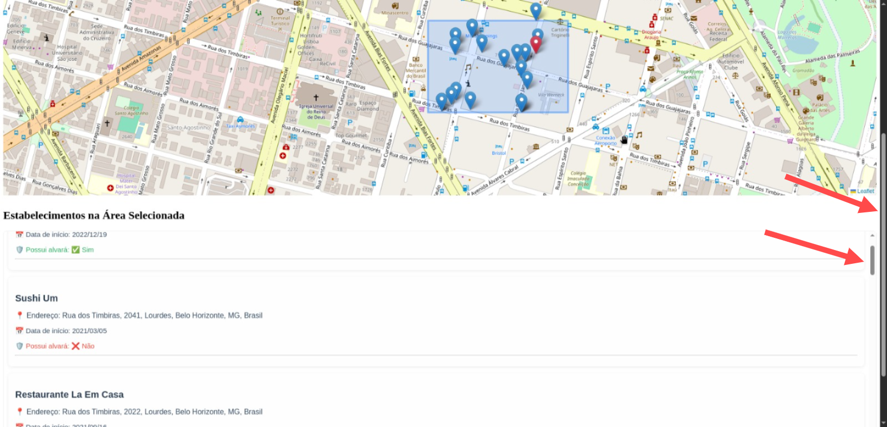
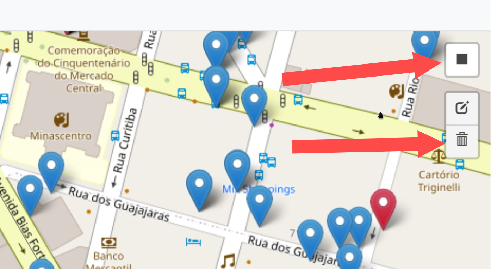

# 📍 Sistema Interativo de Consulta Ortogonal de Estabelecimentos Comerciais

Este projeto implementa um sistema interativo para visualização e filtragem de bares e restaurantes registrados na base de dados da Prefeitura de Belo Horizonte (PBH). O sistema utiliza um mapa interativo que permite selecionar áreas retangulares para consulta ortogonal, retornando os estabelecimentos dentro dessa região.



🔗 Acesse o sistema aqui: [tp1-alg2-uq38.onrender.com](https://tp1-alg2-uq38.onrender.com/)

---

## 🧭 Descrição do Projeto

O sistema desenvolvido tem como objetivo permitir aos usuários:

- Visualizar bares e restaurantes como **pinos de localização** sobre o mapa da cidade de Belo Horizonte.
- Visualizar **informações complementares** dos estabelecimentos em uma tabela logo abaixo do mapa.
- Utilizar uma **ferramenta de seleção retangular** para filtrar os estabelecimentos exibidos.
- Utilizar uma **estrutura de dados k-d tree** para realizar consultas eficientes baseadas em coordenadas geográficas (latitude e longitude).

---

## 🗺️ Tecnologias Utilizadas

- **[Dash Leaflet](https://github.com/thedirtyfew/dash-leaflet)**: construção do mapa interativo, integrando recursos do Dash e do Leaflet.
- **[Dash (Plotly)](https://dash.plotly.com/)**: construção da interface web.
- **[OpenStreetMap API](https://www.openstreetmap.org/)**: obtenção de coordenadas geográficas dos estabelecimentos.
- **Webscraping**: integração com dados do **Comida di Buteco 2025**.
- **k-d Tree**: estrutura de dados utilizada para consultas ortogonais eficientes.

---

## 📊 Fontes de Dados

- 📂 **Prefeitura de Belo Horizonte - Atividades Econômicas (2025-04-01)**  
  🔗 [Acessar no portal de dados abertos](https://dados.pbh.gov.br/dataset/atividades-economicas1)

- 🍽️ **Comida di Buteco 2025**  
  🔍 Dados obtidos via scraping — código disponível na pasta [`./scraping`](./scraping)

---

## 🔍 Funcionalidades

- ✅ Mapa interativo com suporte a **zoom**, essencial para visualização eficiente de mais de **13 mil pontos**:

  

- ✅ Pop-ups com os dados dos bares do **Comida di Buteco** com marcadores **vermelhos**:

  

- ✅ Ferramenta de **seleção retangular** sobre o mapa para realizar consultas espaciais:

  

- ✅ Tabela interativa com os resultados dos estabelecimentos **dentro da área selecionada**:

  

- ✅ Botão de **desenhar retângulo** e de **limpar seleção** para redefinir a área e restaurar a exibição total:

  

---

## 🧪 Como Usar

### 1. Instalação

Clone o repositório e instale as dependências com:

```bash
git clone https://github.com/seu-usuario/seu-repositorio.git
cd seu-repositorio
pip install -r requirements.txt
```

Para executar local:

```bash
python app.py
```